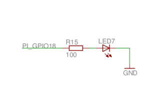
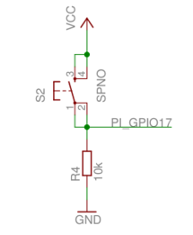
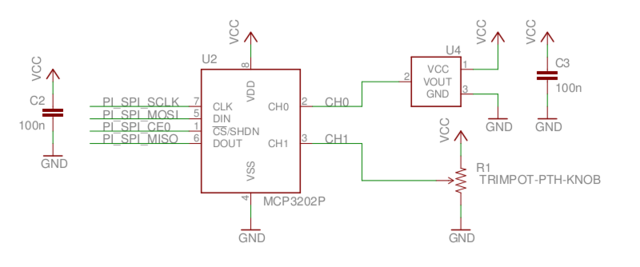
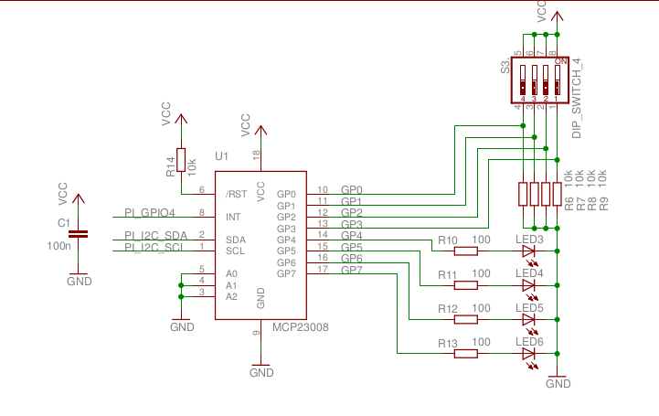

# elixir_ale - Elixir Actor Library for Embedded

[](https://travis-ci.org/fhunleth/elixir_ale)
[](https://hex.pm/packages/elixir_ale)
[](https://ebertapp.io/github/fhunleth/elixir_ale)

`elixir_ale` provides high level abstractions for interfacing to GPIOs, I2C
buses and SPI peripherals on Linux platforms. Internally, it uses the Linux
sysclass interface so that it does not require platform-dependent code.

`elixir_ale` works great with LEDs, buttons, many kinds of sensors, and simple
control of motors. In general, if a device requires high speed transactions or
has hard real-time constraints in its interactions, this is not the right
library. For those devices, it is recommended to look at other driver options, such
as using a Linux kernel driver.

If this sounds similar to [Erlang/ALE](https://github.com/esl/erlang-ale), that's because it is. This
library is a Elixir-ized implementation of the original project with some updates
to the C side. (Many of those changes have made it back to the original project
now.)

# Getting started

If you're natively compiling elixir_ale, everything should work like any other
Elixir library. Normally, you would include elixir_ale as a dependency in your
`mix.exs` like this:

    def deps do
      [{:elixir_ale, "~> 1.0"}]
    end

If you just want to try it out, you can do the following:

    git clone https://github.com/fhunleth/elixir_ale.git
    cd elixir_ale
    mix compile
    iex -S mix

If you're cross-compiling, you'll need to setup your environment so that the
right C compiler is called. See the `Makefile` for the variables that will need
to be overridden. At a minimum, you will need to set `CROSSCOMPILE`,
`ERL_CFLAGS`, and `ERL_EI_LIBDIR`.

`elixir_ale` doesn't load device drivers, so you'll need to make sure that any
necessary ones for accessing I2C or SPI are loaded beforehand. On the Raspberry
Pi, the [Adafruit Raspberry Pi I2C
instructions](https://learn.adafruit.com/adafruits-raspberry-pi-lesson-4-gpio-setup/configuring-i2c)
may be helpful.

If you're trying to compile on a Raspberry Pi and you get errors indicated that Erlang headers are missing
(`ie.h`), you may need to install erlang with `apt-get install
erlang-dev` or build Erlang from source per instructions [here](http://elinux.org/Erlang).

# Examples

`elixir_ale` only supports simple uses of the GPIO, I2C, and SPI interfaces in
Linux, but you can still do quite a bit. The following examples were tested on a
Raspberry Pi that was connected to an [Erlang Embedded Demo
Board](http://solderpad.com/omerk/erlhwdemo/). There's nothing special about
either the demo board or the Raspberry Pi, so these should work similarly on
other embedded Linux platforms.

## GPIO

A [General Purpose Input/Output](https://en.wikipedia.org/wiki/General-purpose_input/output) (GPIO)
is just a wire that you can use as an input or an output. It can only be
one of two values, 0 or 1. A 1 corresponds to a logic high voltage like 3.3 V
and a 0 corresponds to 0 V. The actual voltage depends on the hardware.

Here's an example of turning an LED on or off:



To turn on the LED that's connected to the net (or wire) labeled
`GPIO18`, run the following:

    iex> alias ElixirALE.GPIO
    iex> {:ok, pid} = GPIO.start_link(18, :output)
    {:ok, #PID<0.96.0>}

    iex> GPIO.write(pid, 1)
    :ok

Input works similarly. Here's an example of a button with a pull down
resistor connected.



If you're not familiar with pull up or pull down
resistors, they're resistors whose purpose is to drive a wire
high or low when the button isn't pressed. In this case, it drives the
wire low. Many processors have ways of configuring internal resistors
to accomplish the same effect without needing to add an external resistor.
It's platform-dependent and not shown here.

The code looks like this in `elixir_ale`:

    iex> {:ok, pid} = GPIO.start_link(17, :input)
    {:ok, #PID<0.97.0>}

    iex> GPIO.read(pid)
    0

    # Push the button down

    iex> GPIO.read(pid)
    1

If you'd like to get a message when the button is pressed or released, call the
`set_int` function. You can trigger on the `:rising` edge, `:falling` edge or
`:both`.

    iex> GPIO.set_int(pid, :both)
    :ok

    iex> flush
    {:gpio_interrupt, 17, :rising}
    {:gpio_interrupt, 17, :falling}
    :ok

Note that after calling `set_int`, the calling process will receive an initial
message with the state of the pin. This prevents the race condition between
getting the initial state of the pin and turning on interrupts. Without it,
you could get the state of the pin, it could change states, and then you could
start waiting on it for interrupts. If that happened, you would be out of sync.

## SPI

A [Serial Peripheral Interface](https://en.wikipedia.org/wiki/Serial_Peripheral_Interface_Bus)
(SPI) bus is a common multi-wire bus used to connect components on a circuit
board. A clock line drives the timing of sending bits between components. Bits
on the Master Out Slave In `MOSI` line go from the master (usually the
processor running Linux) to the slave, and bits on the Master In Slave Out
`MISO` line go the other direction. Bits transfer both directions
simultaneously. However, much of the time, the protocol used across the SPI
bus has a request followed by a response and in these cases, bits going the
"wrong" direction are ignored. This will become more clear in the example below.

The following shows an example Analog to Digital Converter (ADC) that
reads from either a temperature sensor on CH0 (channel 0) or a potentiometer on
CH1 (channel 1). It converts the analog measurements to digital, and sends the
digital measurements to SPI pins on the main processor running Linux (e.g.
Raspberry Pi). Many processors, like the one on the Raspberry Pi, can't read
analog signals directly, so they need an ADC to convert the signal.



The protocol for talking to the ADC in the example below is described in the
[MCP3002](http://www.microchip.com/wwwproducts/en/MCP3002) data sheet. The
protocol is very similar to an application program interface (API) for
software. It will tell you the position and function of the bits you will send
to the ADC, along with how the data (in the form of bits)
will be returned.

See Figure 6-1 in the data sheet for the communication protocol. Sending a
`0x68` first reads the temperature and sending a `0x78` reads the
potentiometer. Since the data sheet shows bits, `0x68` corresponds to `01101000b`.
The leftmost bit is the "Start" bit. The second bit is SGL/DIFF, the third
bit is ODD/SIGN, and the fourth bit is MSBF. From table 5-1, if SGL/DIFF==1,
ODD/SIGN==0, and MSBF==1 then that specifies channel 0 which is connected to
the thermometer.

    # Make sure that you've enabled or loaded the SPI driver or this will
    # fail.
    iex> alias ElixirALE.SPI
    iex> {:ok, pid} = SPI.start_link("spidev0.0")
    {:ok, #PID<0.124.0>}

    # Read the potentiometer

    # Use binary pattern matching to pull out the ADC counts (low 10 bits)
    iex> <<_::size(6), counts::size(10)>> = SPI.transfer(pid, <<0x78, 0x00>>)
    <<1, 197>>

    iex> counts
    453

    # Convert counts to volts (1023 = 3.3 V)
    iex> volts = counts / 1023 * 3.3
    1.461290322580645

As shown above, you'll find out that Elixir's binary pattern matching is
extremely convenient when working with hardware. More information can be
found in the [Kernel.SpecialForms documentation](https://hexdocs.pm/elixir/Kernel.SpecialForms.html#%3C%3C%3E%3E/1)
and by running `h <<>>` at the IEx prompt.

## I2C

An [Inter-Integrated Circuit](https://en.wikipedia.org/wiki/I%C2%B2C) (I2C)
bus is similar to a SPI bus in function, but uses fewer wires. It
supports addressing hardware components and bidirectional use of the data line.

The following shows a bus IO expander connected via I2C to the processor.



The protocol for talking to the IO expander is described in the [MCP23008
Datasheet](http://www.microchip.com/wwwproducts/Devices.aspx?product=MCP23008).
Here's a simple example of using it.

    # On the Raspberry Pi, the IO expander is connected to I2C bus 1 (i2c-1).
    # Its 7-bit address is 0x20. (see datasheet)
    iex> alias ElixirALE.I2C
    iex> {:ok, pid} = I2C.start_link("i2c-1", 0x20)
    {:ok, #PID<0.102.0>}

    # By default, all 8 GPIOs are set to inputs. Set the 4 high bits to outputs
    # so that we can toggle the LEDs. (Write 0x0f to register 0x00)
    iex> I2C.write(pid, <<0x00, 0x0f>>)
    :ok

    # Turn on the LED attached to bit 4 on the expander. (Write 0x10 to register
    # 0x09)
    iex> I2C.write(pid, <<0x09, 0x10>>)
    :ok

    # Read all 11 of the expander's registers to see that the bit 0 switch is
    # the only one on and that the bit 4 LED is on.
    iex> I2C.write(pid, <<0>>)  # Set the next register to be read to 0
    :ok

    iex> I2C.read(pid, 11)
    <<15, 0, 0, 0, 0, 0, 0, 0, 0, 17, 16>>

    # The operation of writing one or more bytes to select a register and
    # then reading is very common, so a shortcut is to just run the following:
    iex> I2C.write_read(pid, <<0>>, 11)
    <<15, 0, 0, 0, 0, 0, 0, 0, 0, 17, 16>>

    # The 17 in register 9 says that bits 0 and bit 4 are high
    # We could have just read register 9.

    iex> I2C.write_read(pid, <<9>>, 1)
    <<17>>

## FAQ

### Where can I get help?

Most issues people have are on how to communicate with hardware for the first
time. Since `elixir_ale` is a thin wrapper on the Linux sys class interface, you
may find help by searching for similar issues when using Python or C.

For help specifically with `elixir_ale`, you may also find help on the
nerves channel on the [elixir-lang Slack](https://elixir-slackin.herokuapp.com/).
Many [Nerves](http://nerves-project.org) users also use `elixir_ale`.

### Why isn't elixir_ale a NIF?

While `elixir_ale` should never crash, it's hard to guarantee that weird
conditions on the I2C or SPI buses wouldn't hang the Erlang VM. `elixir_ale`
errors on the side of safety of the VM.

### I tried turning on and off a GPIO as fast as I could. Why was it slow?

Please don't do that - there are so many better ways of accomplishing whatever
you're trying to do:

  1. If you're trying to drive a servo or dim an LED, look into PWM. Many
     platforms have PWM hardware and you won't tax your CPU at all. If your
     platform is missing a PWM, several chips are available that take I2C
     commands to drive a PWM output.
  2. If you need to implement a wire level protocol to talk to a device, look
     for a Linux kernel driver. It may just be a matter of loading the right
     kernel module.
  3. If you want a blinking LED to indicate status, `elixir_ale` really should
     be fast enough to do that, but check out Linux's LED class interface. Linux
     can flash LEDs, trigger off events and more. See [nerves_leds](https://github.com/nerves-project/nerves_leds).

If you're still intent on optimizing GPIO access, you may be interested in
[gpio_twiddler](https://github.com/fhunleth/gpio_twiddler).

### Where's PWM support?

On the hardware that I normally use, PWM has been implemented in a
platform-dependent way. For ease of maintenance, `elixir_ale` doesn't have any
platform-dependent code, so supporting it would be difficult. An Elixir PWM
library would be very interesting, though, should anyone want to implement it.

### Can I develop code that uses elixir_ale on my laptop?

You'll need to fake out the hardware. Code to do this depends
on what your hardware actually does, but here's one example:

  * http://www.cultivatehq.com/posts/compiling-and-testing-elixir-nerves-on-your-host-machine/

Please share other examples if you have them.

### How do I debug?

The most common issue is communicating with an I2C or SPI device for the first time.
For I2C, first check that an I2C bus is available:

```
iex> ElixirALE.I2C.device_names
["i2c-1"]
```

If the list is empty, then I2C is either not available, not enabled, or not
configured in the kernel. If you're using Raspbian, run `raspi-config` and check
that I2C is enabled in the advanced options. If you're on a BeagleBone, try
running `config-pin` and see the [Universal I/O
project](https://github.com/cdsteinkuehler/beaglebone-universal-io) to enable
the I2C pins. On other ARM boards, double check that I2C is enabled in the
kernel and that the device tree configures it.

Once an I2C bus is available, try detecting devices on it:

```
iex> ElixirALE.I2C.detect_devices("i2c-1")
[4]
```

The return value here is a list of device addresses that were detected. It is
still possible that the device will work even if it does not detect, but you
probably want to check wires at this point. If you have a logic analyzer, use it
to verify that I2C transactions are being initiated on the bus.

Options for debugging a SPI issue are more limited. First check that the SPI bus
is available:
```
iex> ElixirALE.SPI.device_names
["spidev0.0", "spidev0.1"]
```

If nothing is returned, verify that SPI is enabled and configured on your
system. The steps are identical to the I2C ones above except looking for SPI.

If you're having trouble with GPIOs, the files controlling them are in
`/sys/class/gpio`. ElixirALE is a thin wrapper on the files so if something can
be accomplished there, it usually can be accomplished in ElixirALE. One big
omission from the directory is support for internal pull-ups and pull-downs.
These are very convenient for buttons so that external resisters aren't needed.
Unfortunately, the way to handle pull-ups and pull-downs is device specific. If
you're on a Raspberry Pi, see [gpio_rpi](https://hex.pm/packages/gpio_rpi).

### Will it run on Arduino?

No. Elixir ALE only runs on Linux-based boards. If you're interested in controlling an Arduino from a computer that can run Elixir, check out [nerves_uart](https://hex.pm/packages/nerves_uart) for communicating via the Arduino's serial connection or [firmata](https://github.com/mobileoverlord/firmata) for communication using the Arduino's Firmata protocol.

### Can I help maintain elixir_ale?

Yes! If your life has been improved by `elixir_ale` and you want to give back,
it would be great to have new energy put into this project. Please email me.

# License

This library draws much of its design and code from the Erlang/ALE project which
is licensed under the Apache License, Version 2.0. As such, it is licensed
similarly.
